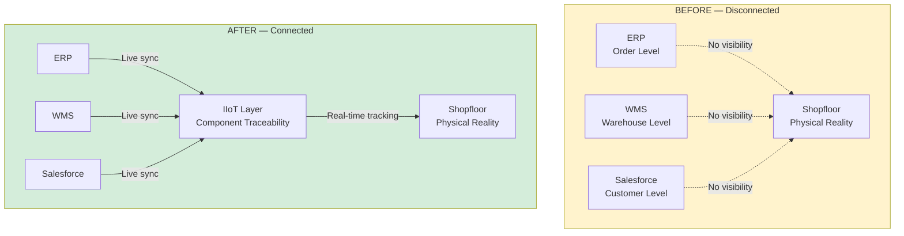

# Component Traceability Breakdown

**Industry:** Solar Energy — Component Manufacturing & Supply
**Area:** Manufacturing, Internal Logistics, Kitting & Dispatch
**Engagement Type:** On-site Assessment → Consultative Proposal

---

## Situation

A component manufacturer supplying parts for solar panel mounting
structures to a solar panel OEM.

The client had an ERP system integrated with their customer's ERP —
a solid digital setup on paper. Orders flowed in. Production ran.
Dispatches went out.

But operationally, the system was failing repeatedly.

---

## Observation

Symptoms visible at the time of engagement:

- OTAs missed despite production completing on time
- Wrong parts dispatched to customers
- Components manufactured but unavailable at kitting stage
- Kit combinations incorrect — 8,000–9,000+ active variations
  at the time, growing with every new model and custom requirement

The client had assumed the ERP integration was sufficient.
The shopfloor told a different story.

---

## How We Got Involved

The customer invited us to assess an automation requirement on a
specific sub-assembly line.

Standard practice during any assessment is a Gemba walk —
observing the broader workflow, not just the immediate brief.

That Gemba walk is where the internal logistics breakdown became
visible. The automation requirement was real. But the larger
operational problem was bigger than any single sub-assembly.

We widened the conversation.

---

## Root Cause

The missing piece was **component traceability**.

No system was tracking each component across its full internal journey.

### The Component's Physical Journey

### What the Systems Knew

- **ERP** knew what was ordered
- **WMS** knew what was in warehouse (in theory)
- **Salesforce** managed the customer relationship

### What Nobody Knew

- Where a specific component physically was at any moment
- Which components were in transit between stages
- Whether a component was available for kitting or already allocated
- Which kit variations had complete or incomplete component sets

With thousands of kit variations and zero component-level traceability,
the digital layer and physical reality were permanently out of sync.

Every missed OTA, wrong dispatch and kitting failure was a
symptom of the same root cause — **an invisible physical layer.**

---

## Proposed Solution

An IIoT-enabled smart assembly system with full ERP integration.

### What Changed

### Implementation

- Machines pulling and pushing data automatically to live orders
- Manual data entry eliminated at the process level
- Internal logistics, process transfers and kitting connected
  into the same data layer
- Component-level traceability from manufacturing through to dispatch
- Integration across ERP, WMS and Salesforce

The proposal connected every physical movement to the digital system —
so the two layers could no longer drift apart.

---

## Customer Response

The customer got curious.

What started as an automation conversation became an operational
visibility conversation. They opened up about challenges they had
been carrying for months — wrong dispatches, kitting failures,
customer complaints — and asked directly whether IIoT could solve them.

That shift — from automation brief to operational diagnosis —
is what a Gemba walk enables.

---

## Expected Impact

- OTA accuracy restored through real-time production-to-order linking
- Dispatch errors eliminated through component-level scanning
  and verification
- Kitting accuracy improved through live inventory visibility
  at the component level
- Kit variation management scaled without proportional increase
  in manual effort
- ERP, WMS and Salesforce aligned to physical reality in real time

---

## Insight

> A connected system on paper is not a connected system in practice.
>
> ERP integration at the order level does not mean visibility
> at the component level. The gap between the two is exactly
> where traceability lives — and exactly where most manufacturing
> operations lose control.

---

## Related Topics

- [Industry 4.0 & IIoT — Foundations](../00-introduction-industry40-iiot/README.md)
- [Sensing, Connectivity & Networking](../01-sensing-connectivity-networking/README.md)
- [Practitioner Glossary → Traceability](../resources/glossary.md#traceability)
- [Practitioner Glossary → CPS](../resources/glossary.md#cps)
- [Practitioner Glossary → IIoT](../resources/glossary.md#iiot)

