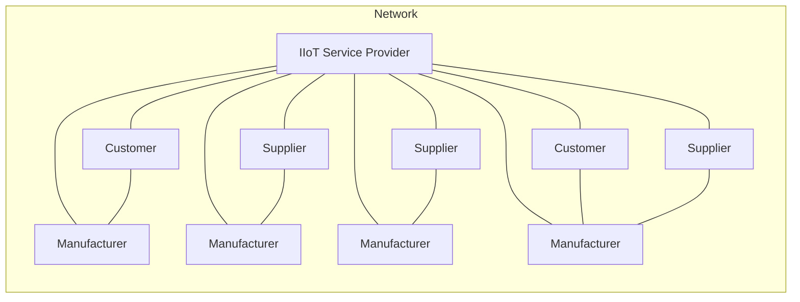

# 📺 Lecture 01 — Sensing and Actuation

> 📁 **Week 01** · NOC: Introduction to Industry 4.0 and IIoT
> 👨‍🏫 **Instructor:** Prof. Sudip Misra, IIT Kharagpur
> 📅 **Date Watched:** —
> ⏱️ **Duration:** —

---

## 🗒️ Raw Notes

> Phases of Industrial Revolution

- Phase 1: Steam Engine & Mechanisation
- Phase 2: Electricity - Mass Production
- Phase 3: Computers & Digital Revolution
- Phase 4: Use of sensors, connectivity, AI, machine learning, CPS, machine-to-machine communication to develop smart factories, smart inventory management, smart supply chain management.

4th revolution started in Germany to boost the German economy. Started at Hannover Fair in 2011.

IIOT: IoT with AI, ML & Industry 4.0 is IIoT. It is to improve working conditions, operational efficiency, & machine lifetime.

Short introduction of course overview.

Short animated video: IIOT & Industry 4.0

Industry 4.0 is characterised by ubiquitous & mobile internet systems, smart sensors, smart & connected machines with highly automated systems and strong connectivity.

Smart Manufacturing: Helps to control & monitor manufacturing.

IIOT helps manufacturing, inventory, order management including tracking, supply chain management.

### Example of Two Companies

**Company A**
- Invests in marketing & logistics

**Company B**
- Invests in marketing only

Company B runs operations on assumptions:
- Gains more orders initially
- No optimised operations
- No OTA with increased orders
- Operations can't cope up with increased orders

Company A:
- Initially less orders but smooth, optimised operations
- Control & monitoring of every aspect of supply chain, logistics, manufacturing & order management
- Increased efficiency & consistent growth

---

## 💡 Key Concepts

> This lecture introduces the foundational concepts of Industry 4.0 and the Industrial Internet of Things (IIoT).

### The Four Industrial Revolutions

**1st Revolution:** Advent of the steam engine and mechanisation.

**2nd Revolution:** Mass production powered by electricity.

**3rd Revolution:** The digital revolution, driven by computers and automation.

**4th Revolution (Industry 4.0):** The current era characterised by AI, machine learning, sensors, machine-to-machine (M2M) communication, connectivity, and cyber-physical systems (CPS).

### Industry 4.0 & IIoT

- Industry 4.0 was introduced in Germany at the Hannover Fair in 2011.
- It focuses on developing smart factories, intelligent inventory systems, and connected supply chains.
- IIoT combines IoT technologies with industrial processes.
- The primary objectives are:
  - Improving operational efficiency
  - Increasing machine lifetime
  - Enhancing worker safety
  - Enabling data-driven decision-making

### Core Concepts Covered

**IoT Fundamentals**
- Sensors and actuators
- Connectivity
- Communication and networking protocols

**Key Enabling Technologies**
- AI and Machine Learning
- Smart sensors
- Connectivity platforms
- Cyber-Physical Systems (CPS)

**Software-Defined Networks (SDN)**
- Flexible and efficient networking architectures for industrial IoT applications

**Security**
- Challenges associated with securing connected industrial environments

**Case Studies**
- Comparison between traditional and IIoT-enabled operations
- Real-time monitoring for logistics and supply chain optimisation
- Improved visibility, route planning, and cost management

---

## 📐 Diagrams & Visuals

---

## 📖 New Terms Encountered

| Term | My Understanding | Added to Glossary? |
|------|-----------------|-------------------|
| — | — | ⬜ No |

---

## 🔗 Connections to Other Concepts

> How does this lecture connect to something you already know,
> or to another lecture/week?

---

## ❓ Questions & Confusions

> Things you didn't fully understand — to revisit later.

---

## ⭐ Most Important Point

> If you had to remember ONE thing from this lecture, what is it?

---

## 🔗 Navigation

| | Link |
|-|------|
| 📁 Week 01 Home | [README.md](./README.md) |
| ⬅️ Previous | — |
| ➡️ Next | [Lecture 02](./lecture-02.md) |

---

*Date Watched: —*
