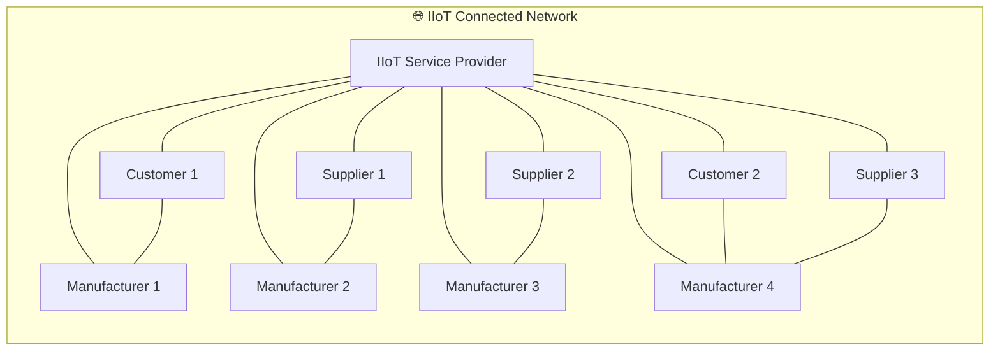

# 📺 Lecture 01 — Introduction to Industry 4.0 and IIoT

> 📁 **Week 01** · NOC: Introduction to Industry 4.0 and IIoT
> 👨‍🏫 **Instructor:** Prof. Sudip Misra, IIT Kharagpur
> 📅 **Date Watched:** 7th July 2026
> ⏱️ **Duration:** 13 min

---

## 🗒️ Raw Notes

### Phases of Industrial Revolution

- **Phase 1:** Steam Engine & Mechanisation
- **Phase 2:** Electricity & Mass Production
- **Phase 3:** Computers & Digital Revolution
- **Phase 4:** Sensors, connectivity, AI, ML, CPS & M2M communication → smart factories, smart inventory & smart supply chain management

> 📌 The 4th Industrial Revolution originated in **Germany** to boost the German economy — officially announced at the **Hannover Fair in 2011.**

---

### What is IIoT?

> IoT + AI + ML + Industry 4.0 = **IIoT**

IIoT aims to improve:
- 👷 Working conditions
- ⚙️ Operational efficiency
- 🔧 Machine lifetime

---

### Industry 4.0 — Characteristics

- 📶 Ubiquitous & mobile internet systems
- 🔍 Smart sensors
- 🤖 Smart & connected machines
- 🏭 Highly automated systems
- 🔗 Strong connectivity

---

### What Does IIoT Enable?

- 🏭 Smart Manufacturing — control & monitor manufacturing processes
- 📦 Inventory management
- 📋 Order management & tracking
- 🚚 Supply chain management

---

### Company A vs Company B

| | **Company A** | **Company B** |
|-|--------------|--------------|
| **Investment** | Marketing + Logistics (IIoT) | Marketing only |
| **Operations** | Optimised, controlled, data-driven | Assumption-based, unoptimised |
| **Scalability** | Handles increased orders smoothly | Can't cope when orders scale |
| **Visibility** | Full control across supply chain, manufacturing & logistics | None |
| **Outcome** | Consistent growth & efficiency | Stagnant, reactive operations |

> 💡 Company A starts with fewer orders but builds a strong operational
> foundation — leading to consistent long-term growth. Company B has no
> visibility or control when demand scales up.

---

## 💡 Key Concepts

### The Four Industrial Revolutions

Each revolution was triggered by a single transformative technology:

| Revolution | Era | Trigger |
|------------|-----|---------|
| Industry 1.0 | ~1760s | Steam Engine & Mechanisation |
| Industry 2.0 | ~1870s | Electricity & Mass Production |
| Industry 3.0 | ~1960s | Computers & Digital Automation |
| Industry 4.0 | 2011– | IoT, AI, ML, CPS, M2M Connectivity |

---

### What Makes Industry 4.0 Different?

Previous revolutions replaced or augmented **physical labour.**
Industry 4.0 is different — it integrates:

- Physical systems with **digital intelligence**
- **Real-time sensor data** feeding directly into decisions
- **M2M communication** — machines coordinating without human intervention in the loop

The result is not just automation — it is **connected, self-aware operations.**

---

### IIoT in the Value Chain

IIoT connects every stakeholder — customers, suppliers, manufacturers —
through a central intelligent service layer. This enables real-time
coordination, full visibility and operational responsiveness across
the entire value chain — not just inside a factory.

---

## 📐 Diagram — IIoT Connectivity Network

> Recreated from the animated video shown in the lecture.
> The IIoT Service Provider acts as the central intelligence hub —
> connecting all stakeholders across the value chain.



> Every node has visibility into the network in real time —
> orders, production, logistics and supply are all connected
> through one intelligent layer.

---

## 📖 Terms Worth Noting

> Only terms that were either new to me, used in a specific
> Industry 4.0 context, or worth documenting for quick recall.

| Term | Note | Added to Glossary? |
|------|------|--------------------|
| **Ubiquitous Internet** | "Ubiquitous" = present everywhere simultaneously. In I4.0 context — internet connectivity available across all machines, locations & systems at all times, not just at a workstation | ✅ Yes |
| **CPS** | Cyber-Physical Systems — tight integration of computation, networking & physical processes. Introduced here as a component of I4.0, technical depth expected in later weeks | ✅ Yes |
| **M2M Communication** | Machine-to-Machine — devices exchange data & trigger actions directly without human intervention. Core enabler of smart factory automation | ✅ Yes |
| **Hannover Fair** | Major industrial trade fair in Germany — where Industry 4.0 was officially coined and announced in 2011 | ✅ Yes |

---

## 🔗 Connections & Real-World Experience

### 🤔 Forward Connections — To Revisit

- The **Company A vs B** example feels like a direct argument for
  operational data visibility & real-time decision making —
  likely connects to topics on Big Data, Analytics or ERP integration
  in later weeks. To revisit once those weeks are covered.

- **CPS** was introduced briefly here — expecting deeper technical
  coverage in later weeks. Holding questions until then.

---

### 💼 Real-World Experience — Component Traceability in IIoT

> This lecture reminded me of a project I was directly involved in.

**Context:** A component manufacturer supplying parts for solar panel
mounting structures to a solar panel company.

The client had an ERP system integrated with their customer's ERP —
a solid setup on paper. But operationally, it was failing repeatedly:

- OTAs missed despite production completing on time
- Wrong parts dispatched to customers
- Kitting inaccuracies — components manufactured but unavailable at
  kitting stage
- Kit combinations were off — 8,000–9,000+ variations at the time,
  growing with new models and custom requirements

**How We Got Involved:**

The customer invited us for an automation requirement on a specific
sub-assembly. As standard practice during assessment we did a
**Gemba walk** — observing the broader workflow around that assembly.
That's where the internal logistics breakdown became visible.

**What We Proposed:**

An IIoT-enabled smart assembly system with full ERP integration —
pulling and pushing data automatically, eliminating manual data entry,
connecting machines and internal workflows directly to live orders.

We also proposed IIoT-enabling their other systems — integrating
internal logistics, process transfers and kitting into the same
connected layer.

The customer got curious. They opened up about the operational
issues they'd been struggling with and asked whether IIoT could
solve them.

**Root Cause We Identified:**

The missing piece was **component traceability** — tracking every
component from:

```
Manufacturing → Internal Logistics → Process / Machine Transfers
→ Kitting → Dispatch
```

...all connected to ERP, their Warehouse Management System and
Salesforce.

With thousands of kit variations and no traceability at the
component level, their digital system and physical reality were
permanently out of sync.

**Connection to This Lecture:**

This is a direct, real-world version of the **Company A vs Company B**
example from the lecture. The client had invested in a connected
system (ERP + customer ERP integration) but was still operating on
assumptions at the process level — because the physical layer was
never connected to the digital layer.

Traceability was the bridge.

> 📌 **Note:** Component traceability is not covered in this lecture
> and may or may not appear explicitly in later weeks. It is however
> a critical real-world application of IIoT in manufacturing —
> worth watching for as the course progresses.

---

## ❓ Questions & Confusions

---

## ⭐ Most Important Point

---

## 🔗 Navigation

| | Link |
|-|------|
| 📁 Week 01 Home | [README.md](./README.md) |
| ⬅️ Previous | — |
| ➡️ Next | [Lecture 02](./lecture-02.md) |

---

*Date Watched: 7th July 2026*
